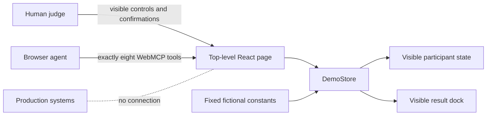

# Infinite Awareness Agent Lab

This **private source repository** contains the standalone Infinite Awareness WebMCP Judge Sandbox deployed at [infiniteawar-mxufc9c2.manus.space](https://infiniteawar-mxufc9c2.manus.space/). It presents one fictional Day 7 participant journey from a 33-day awareness-training programme and lets a judge complete the complete demonstration in under three minutes.

> This is a technical and educational demonstration. It is not medical or psychological treatment, makes no efficacy claim, and contains no real participant, journal, customer, payment or production data.

## Purpose

The challenge build demonstrates how a normal human-facing web experience can also expose a small, inspectable set of browser tools through WebMCP. The page registers exactly eight tools with the imperative `document.modelContext.registerTool(...)` API while preserving a complete visible fallback for browsers without `document.modelContext`.[1] [2]

The participant journey covers the Day 7 **Install - Workspace Expansion** protocol, a fixed three-minute session, structured reflection, explicitly confirmed saving, blinded 0-5 scoring, personal-signal analysis, threshold-gated Global Signal comparison and a full reset.

## Human-agent collaboration principle

The agent may retrieve structured context, prepare the session, draft an observation, analyse fictional signals and explain safety boundaries. It may not silently grant itself permission to save a reflection or record a score. Those two consequential actions depend on visible, page-held confirmation selected by the person.

The public tool schemas contain no confirmation token, identifier or boolean. A successful guarded action consumes its page-held permission immediately. A replay fails, and a failed pre-confirmation attempt neither creates nor consumes permission. This keeps agency with the participant rather than placing consent inside agent-supplied arguments.

## Live sandbox

| Resource | URL |
| --- | --- |
| Public judge sandbox | <https://infiniteawar-mxufc9c2.manus.space/> |
| Judge checklist | [`docs/JUDGE_TESTING.md`](docs/JUDGE_TESTING.md) |
| Under-three-minute script | [`docs/DEMO_SCRIPT.md`](docs/DEMO_SCRIPT.md) |
| Verification report | [`docs/VERIFICATION.md`](docs/VERIFICATION.md) |

The deployed website is maintained separately. Creating this repository does not alter or republish that deployment.

## Exactly eight WebMCP tools

| Tool | Classification | Purpose and boundary |
| --- | --- | --- |
| `get_today_protocol` | **Read only** | Returns the Day 7 phase, purpose and demonstration duration without revealing any assignment. |
| `prepare_session` | State changing | Prepares the fixed three-minute session in visible page state. |
| `draft_observation` | State changing, untrusted content | Converts a direct fictional observation into an unsaved four-part review. User-entered content is treated as untrusted.[3] |
| `save_confirmed_observation` | **Human guarded** | Saves the visible draft to volatile browser memory only after the person selects the one-use save confirmation. |
| `score_blinded_outcome` | **Human guarded** | Records usefulness, novelty and testability scores only after a separate one-use confirmation, without unblinding. |
| `analyse_personal_signal` | **Read only** | Returns descriptive aggregates from the fixed fictional personal history. |
| `compare_collective_signal` | **Read only** | Returns the fixed fictional Global Signal only when the requested minimum sample threshold is met. |
| `explain_safety_boundary` | **Read only** | Returns the educational scope, privacy boundary, epistemic caution and stop rule. |

Exactly four definitions carry `readOnlyHint: true`. The remaining four can change the ephemeral demonstration state. The two guarded actions are `save_confirmed_observation` and `score_blinded_outcome`.

## Visible confirmation and replay protection

The save and scoring permissions use the same three-state lifecycle: unarmed, armed and consumed. The person must select the corresponding checkbox on the rendered page. The first eligible tool call succeeds and changes the permission to consumed; the next call is rejected.

| Attempt | Save result | Score result |
| --- | --- | --- |
| Before visible confirmation | Blocked | Blocked |
| First call after visible confirmation | Succeeds once | Succeeds once |
| Replay after successful use | Blocked as consumed | Blocked as consumed |
| After full reset | Fresh, unselected gate | Fresh, unselected gate |

Both WebMCP and visible fallback actions call the same `DemoStore` methods, so the safety rules do not diverge between human and agent pathways.

## Blinded scoring and privacy protections

The fictional experimental assignment is deliberately absent from application state, page source, structured tool output and browser storage. The interface exposes only the status **Assignment inaccessible**. A successful score result returns `assignmentRevealed: false`.

The Global Signal uses a minimum-sample gate. The fixed cohort contains 48 fictional sessions: a threshold of 40 permits the descriptive aggregate, while 49 suppresses it. These outputs describe only the bundled fictional demonstration and must not be interpreted as evidence of efficacy or causation.

## Fiction-only data boundary

| Boundary | Implementation |
| --- | --- |
| Participant | Fixed fictional persona, Alex Morgan |
| Session and journals | Fixed sample text and ephemeral browser input only |
| Personal scores | Six fixed fictional sessions plus one optional in-page demo score |
| Cohort | 48 fixed fictional aggregate sessions |
| Persistence | In-memory page state only; reload or reset clears changes |
| Authentication and payments | None |
| Database and server APIs | None |
| Production application calls | None |
| Credentials and secrets | None required or included |

The sandbox is a static React application. It does not import production application code, connect to production services or include customer records, real journals, private audio, marketing files, database configuration, payment credentials or authentication credentials.

The two visuals generated specifically for this judge sandbox are included under `client/public/manus-storage` at the same paths used by the deployed application. No private production or campaign asset is included.

## Architecture



`client/src/lib/demoData.ts` contains the fixed fictional constants. `client/src/lib/demoStore.ts` is the single state and safety boundary. `client/src/lib/webmcp.ts` defines the exact eight tool contracts and connects them to the store. `client/src/pages/Home.tsx` registers the tools at the top-level page and renders the normal human journey.

## Local installation and development

Use Node.js 22 and pnpm 10. The checked-in `pnpm-lock.yaml` is the authoritative lockfile.

```bash
pnpm install --frozen-lockfile
pnpm dev
```

Open the local URL printed by Vite. A standard browser displays **Visible-page fallback** and retains the complete demonstration. A compatible browser or agent can discover the eight registered site tools.

No environment variable is required. `.env.example` contains comments and placeholders only; never place a real production value in it.

## Verification commands

| Verification | Command | Expected result |
| --- | --- | --- |
| Frozen dependency installation | `pnpm install --frozen-lockfile` | Completes without changing `pnpm-lock.yaml` |
| Dedicated sandbox and application tests | `pnpm test` | All Vitest files and tests pass |
| TypeScript validation | `pnpm check` | Completes with no TypeScript error |
| Production build | `pnpm build` | Creates `dist/public` and the static server bundle |
| Combined verification | `pnpm verify` | Runs check, test and build in sequence |

The tests cover the exact tool set, read-only immutability, visible confirmation requirements, one-use save and score permissions, replay rejection, hidden-assignment isolation, minimum-sample suppression and reset behaviour.

## Before the challenge and challenge additions

The Infinite Awareness project already had a public visual identity, a broader educational concept, a 33-day programme structure and experimental exploration in `/agent-lab`. Those references were viewed only to understand brand language and the intended participant flow.

This challenge repository adds a **separate, standalone judge sandbox**: the Day 7 three-minute journey, the exact eight WebMCP tools, shared visible and tool-driven state handlers, two explicit human-confirmation gates, one-use replay protection, assignment-inaccessible scoring, fictional personal and Global Signal outputs, sample-threshold suppression, complete reset, non-WebMCP fallback, dedicated tests, CI configuration, judge instructions and verification documentation. No production repository, service, data store, authentication flow, payment flow or Devpost entry was modified.

## Repository safety

The private repository intentionally has no licence. Generated dependencies, builds, logs, caches, environment values and hosting metadata are ignored. Before publication, run the verification commands and review the tracked-file secrets audit described in `docs/VERIFICATION.md`.

## References

[1]: https://developer.chrome.com/docs/ai/webmcp/imperative-api "Chrome for Developers - WebMCP Imperative API"
[2]: https://learn.chatgpt.com/docs/webmcp "OpenAI - Site tools (WebMCP)"
[3]: https://developer.chrome.com/docs/ai/webmcp/secure-tools "Chrome for Developers - WebMCP tool security"
